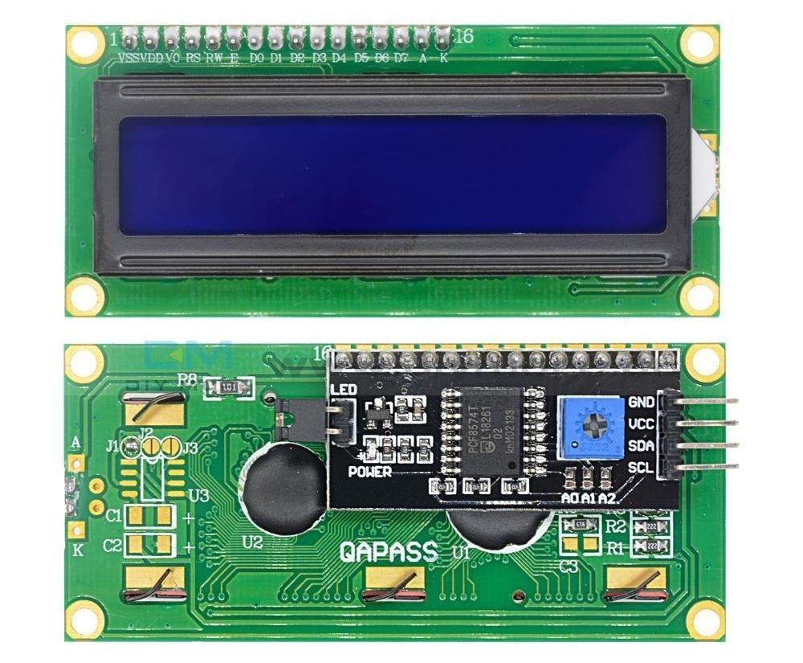
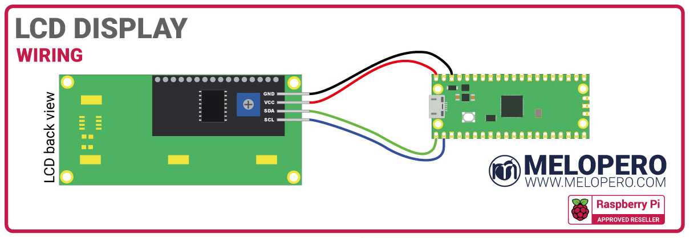

# Melopero 
A MicroPython library for interfacing the <b>Raspberry Pi Pico</b> with the I2C LCD display included in the <b>Melopero Raspberry Pi Pico STARTER KIT</b>
<br> If you want to purchase the Melopero Raspberry Pi Pico starter kit click [HERE](https://www.melopero.com/shop/raspberry-pi/kits/raspberry-pi-pico-starter-kit/)




# Pinout and connections

<table style="width:100%">
  <tr>
    <th>I2C LCD display</th>
    <th>Description</th>
  </tr>
  <tr>
    <td>GND</td>
    <td>Ground pin</td>
  </tr>
  <tr>
    <td>VDD</td>
    <td>Input power pin. Connect to 5V on the Raspberry Pi Pico (pin 40 - VBUS)</td>
  </tr>
  <tr>
    <td>SDA</td>
    <td>I2C Serial DAta pin, connecto to Pico pin 1 (GP0)</td>
  </tr>
  <tr>
    <td>SCL</td>
    <td>I2C Serial CLock pin, connecto to Pico pin 2 (GP1)</td>
  </tr>
 
</table>




### Install the library
We’ve created a downloadable UF2 file to let you install MicroPython with our LCD library included more easily. 
Download it here: 
<br>www.melopero.com/melopero-pico-kit.uf2
<br>Follow the instructions on the official book or on the Raspberry Pi Pico website (section "Getting Started MicroPython")to copy the uf2 file on your Pico: 
<br>https://www.raspberrypi.org/documentation/rp2040/getting-started/#getting-started-with-micropython


## Example
```C++
//This is a basic example


import machine
import utime

import melopero_lcd as mp

lcd = mp.LCD()

adc = machine.ADC(4)
conversion_factor = 3.3 / (65535)

while True:
    reading = adc.read_u16() * conversion_factor
    temperature = 25 - (reading - 0.706) / 0.001721
    
    lcd.output_string('Temp: ')
    lcd.output_string( str(temperature) )
    
    utime.sleep(2)
    lcd.clear()

  
```


